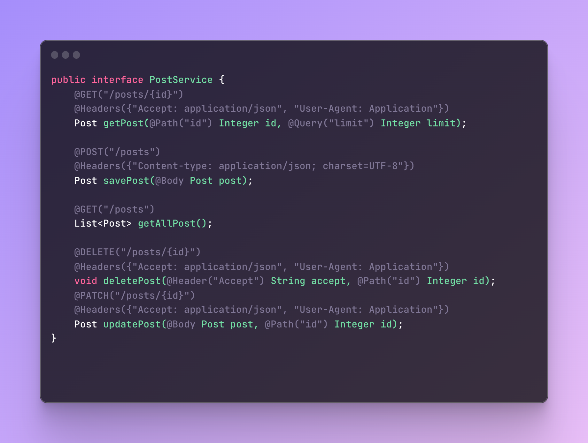

# HTTP Client



```java
public interface PostService {
    @GET("/posts/{id}")
    @Headers({"Accept: application/json", "User-Agent: Application"})
    Post getPost(@Header("Accept") String accept,
                 @Path("id") Integer id,
                 @Query("name") Integer name);

    @POST("/posts")
    @Headers({"Content-type: application/json; charset=UTF-8"})
    Post savePost(@Body Post post);

    @GET("/posts")
    List<Post> getAllPost();

}
```
